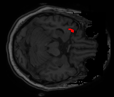
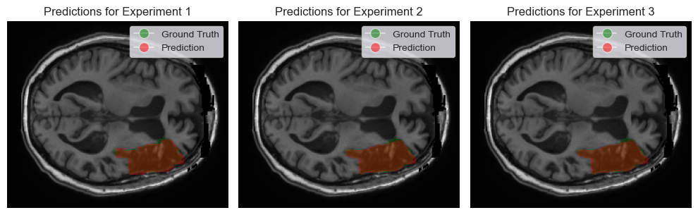
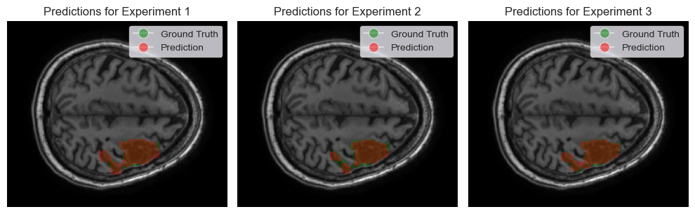

# Fuzzy Information Seeded Region Growing for Automated Lesion After Stroke Segmentation in MRI

## Project Overview
This repository contains the implementation of the Fuzzy Information Seeded Region Growing (FISRG) algorithm for segmenting stroke lesions in brain MRI images. Developed as part of a research project, this algorithm combines fuzzy logic with Seeded Region Growing techniques to tackle the complex task of delineating irregular and diverse textures of stroke lesions.

## Key Features
- **Robust Segmentation**: Capable of handling complex textures and irregular boundaries of stroke lesions in brain MRI scans.
- **Optimized Performance**: Fine-tuned parameters for balancing segmentation accuracy and computational efficiency.
- **Tested on ATLAS Dataset**: Validated and optimized using the comprehensive ATLAS dataset for stroke lesion MRI images.


## Dependencies
This project requires the following libraries:

- OpenCV (cv2): For image processing tasks.
- Pandas: For data manipulation and analysis.
- NumPy: For numerical operations on arrays and matrices.
- Matplotlib: For creating static, interactive, and animated visualizations.
- NiBabel: For reading and writing neuroimaging data formats.
- Scikit-learn (sklearn): For KMeans clustering and other machine learning tasks.
- os: For interacting with the operating system.

To install these dependencies, run the following commands:

```bash
pip install opencv-python
pip install pandas
pip install numpy
pip install matplotlib
pip install nibabel
pip install scikit-learn

```

## Contributing
Contributions to this project are welcome. 

## License
This project is licensed under the [MIT License](LICENSE).

## Acknowledgments
Special thanks to Dr. Enrique Nava Baro and Dr. Ezequiel Lopez Rubio for their guidance and support throughout this project.

## Citation
If you use this algorithm or find this project helpful, please cite:

```bibtex
@article{FISRGStrokeMario,
  title={Fuzzy Information Seeded Region Growing for Automated Lesions After Stroke Segmentation in MR Brain Images},
  author={Mario Pascual González},
  journal = {ArXiv},
  year={2023}
}
```

## Results Overview
Dice coefficient for each Experiment between the predicted mask and the ground truth mask. The algorithm effectively segments the stroke lesion with a maximum dice coefficient of 94.2% and archieves the highest average accuracy in Experiment 3, with an average dice coefficient of 88.1%

| Statistic | Experiment 1 | Experiment 2 | Experiment 3 |
|-----------|--------------|--------------|--------------|
| mean      | 0.849        | 0.865        | 0.881        |
| std       | 0.071        | 0.039        | 0.034        |
| min       | 0.481        | 0.742        | 0.771        |
| max       | 0.934        | 0.942        | 0.942        |


## Some visuals obtained 
### Experiment 3 Results
<p align="center">
  
</p>
(If you don't see the gif moving, press F5 or click in the image)

### Segmentation comparison among experiments
<p align="center">
  
</p>

<p align="center">
  
</p>


## Contact
For any queries, please reach out to [mario.pg02@gmail.com].
